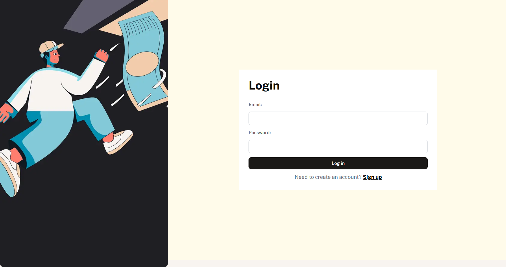
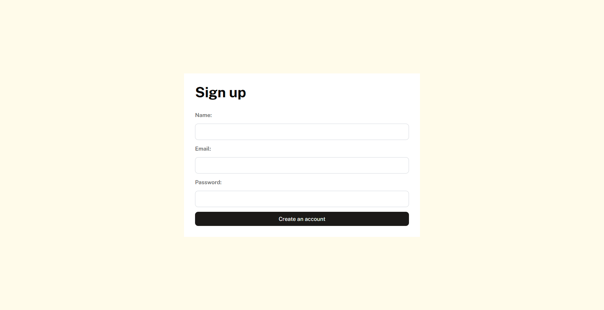
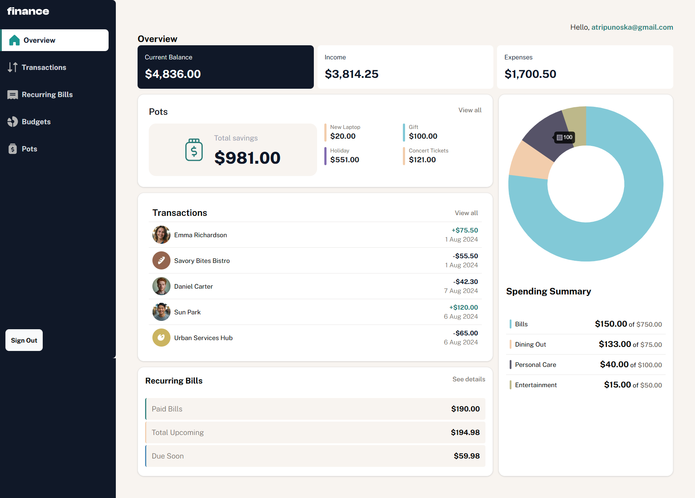
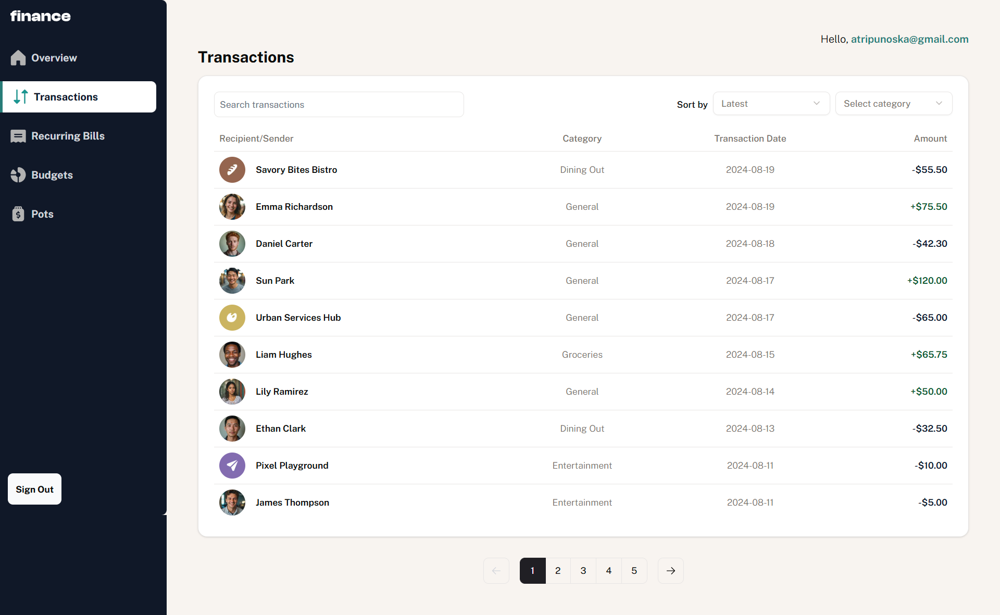
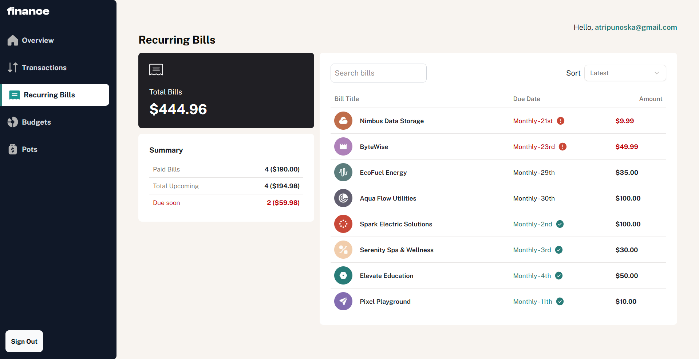
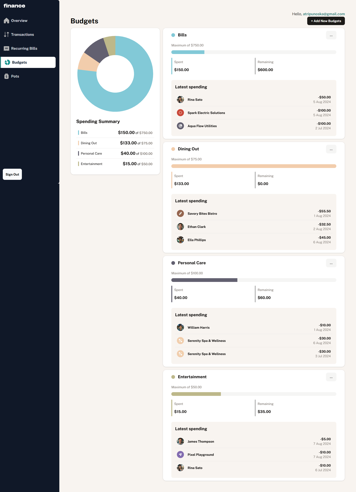
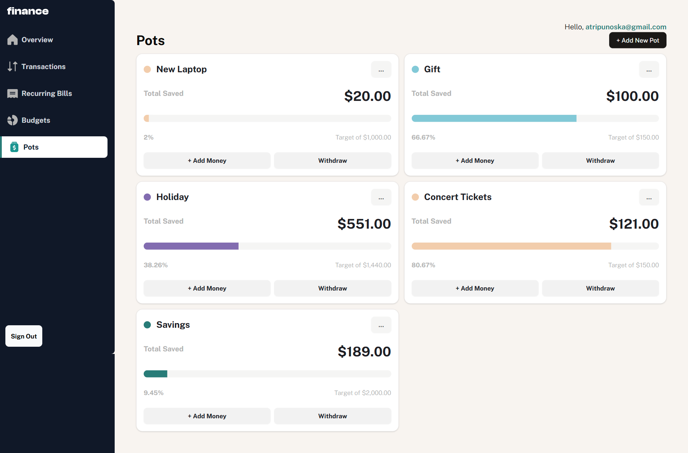

# Personal Finance App

This is a solution to the [Personal finance app challenge on Frontend Mentor](https://www.frontendmentor.io/challenges/personal-finance-app-JfjtZgyMt1). It's a [Next.js](https://nextjs.org) project bootstrapped with [`create-next-app`](https://nextjs.org/docs/app/api-reference/cli/create-next-app).

## Installation

First, clone the repository:

```bash
git clone https://github.com/atripunoska/personal-finance-app.git
cd personal-finance-app
```

Then, install the dependencies:

```bash
npm install
# or
yarn install
# or
pnpm install
# or
bun install
```

Next, run the development server:

```bash
npm run dev
# or
yarn dev
# or
pnpm dev
# or
bun dev
```

Open [http://localhost:3000](http://localhost:3000) with your browser to see the result.

## Environment Variables

Create a `.env.local` file in the root of your project and add the following environment variables:

```env
NEXT_PUBLIC_SUPABASE_URL=your-supabase-url
NEXT_PUBLIC_SUPABASE_ANON_KEY=your-supabase-anon-key
```

Replace `your-supabase-url` and `your-supabase-anon-key` with your actual Supabase URL and anonymous key.

## Project Structure

- `src/`: Contains the source code of the application.
  - `app/`: Contains the Next.js pages and components.
  - `lib/`: Contains utility functions and configurations.
  - `ui/`: Contains reusable UI components.
  - `utils/supabase`: Contains utility functions and configuration for Server-Side Auth for Next.js with Supabse

## Features

- **Dashboard**: Provides an overview of your financial status, including balance, transactions, and recurring bills.
- **Budgets**: Allows you to manage your budgets, including adding, updating, and deleting budgets.
- **Pots**: Manage your savings pots, including adding amounts, withdrawing amounts, and setting targets.
- **Transactions**: View and filter your transactions by category and other criteria.
- **Recurring Bills**: View and manage your recurring bills, including the status of each for the current month.

### Users should be able to:

- See all of the personal finance app data at-a-glance on the overview page
- View all transactions on the transactions page with pagination for every ten transactions
- Search, sort, and filter transactions
- Create, read, update, delete (CRUD) budgets and saving pots
- View the latest three transactions for each budget category created
- View progress towards each pot
- Add money to and withdraw money from pots
- View recurring bills and the status of each for the current month
- Search and sort recurring bills
- Navigate the whole app and perform all actions using only their keyboard
- View the optimal layout for the interface depending on their device's screen size
- See hover and focus states for all interactive elements on the page
- Save details to a database
- Create an account and log in

## Built with

- [Next.js](https://nextjs.org/)
- [Supabase](https://supabase.io/)
- [Tailwind CSS](https://tailwindcss.com/)
- [Chart.js](https://www.chartjs.org/)
- Semantic HTML5 markup
- Flexbox
- CSS Grid
- Web accessibility

## Screenshots

**Login Page**


**Sign Up Page**


**Overview Page**


**Transactions Page**


**Recurring Bills Page**


**Budgets Page**


**Pots Page**


## Author

- [@atripunoska](https://www.github.com/atripunoska)
